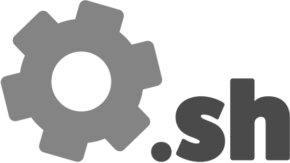

# Setup

> Bootstrap your Mac for software development

[![Build status][1]][2]

---



## Prerequisites

- macOS 10.13 (High Sierra) or newer

These scripts have been tested previously on macOS 10.11 and 10.12, but are no longer guaranteed to work on those
operating systems. Upgrade or run at your own risk!

## Installation

Before installing anything, be sure to read through the source code. Everything is commented thoroughly,
so it shouldn't take too much time to understand what's happening under the hood. Once you've done that, download
the tool:

```bash
$ /usr/bin/easy_install -U setup-mac
```

You can then run the tool as follows:

```bash
$ setup
```

You'll be prompted for your password at the beginning, and asked to confirm a few things as the script runs. When
finished, restart your terminal to see all of the changes. Type `setup --help` to see more info and options.

## Features

Here's what the setup scripts can do:

1. Installs the Xcode command line tools
2. Instals the Homebrew package manager
3. Installs Mac apps with Homebrew Cask
4. Sets up environments and installs packages for a few programming languages:
    - Go
    - Java
    - Node.js (nvm)
    - PHP
    - Python 2 & 3 (pyenv)
    - Ruby (rbenv)
    - Rust
    - Scala
5. Set up the Vim text editor with a great configuration and lots of plugins
6. Creates an SSH key and adds it to the macOS Keychain
7. Changes Terminal theme and Bash prompt
8. Configures Tmux
9. Adds lots of convenient aliases and functions to the shell

## FAQ

1. Can I run this if I've already set up my laptop?
    - Yes; the scripts don't do anything desctructive without your permission, so it's safe to run this even if you've
      already set up your development environment before
2. Do I have to install everything?
    - Nope! There are only a few required steps - namely the Xcode command line tools, Homebrew, and a few dotfiles.
      Everything else is optional.

## Screenshots

`Terminal.app` with the provided `mux` function to create a nice Tmux session:

[Terminal](assets/screenshots/terminal.png)

A Vim window with some open tabs:

[Vim](assets/screenshots/vim.png)

Vim autocompletion, via YouCompleteMe (and Tern.js in this picture):

[Vim autocomplete](assets/screenshots/vim-autocomplete.png)

## Contributing

See [CONTRIBUTING.md](.github/CONTRIBUTING.md).

## License

Copyright (c) 2014-2018 Ty-Lucas Kelley. MIT License.

[1]: TBD
[2]: TBD
